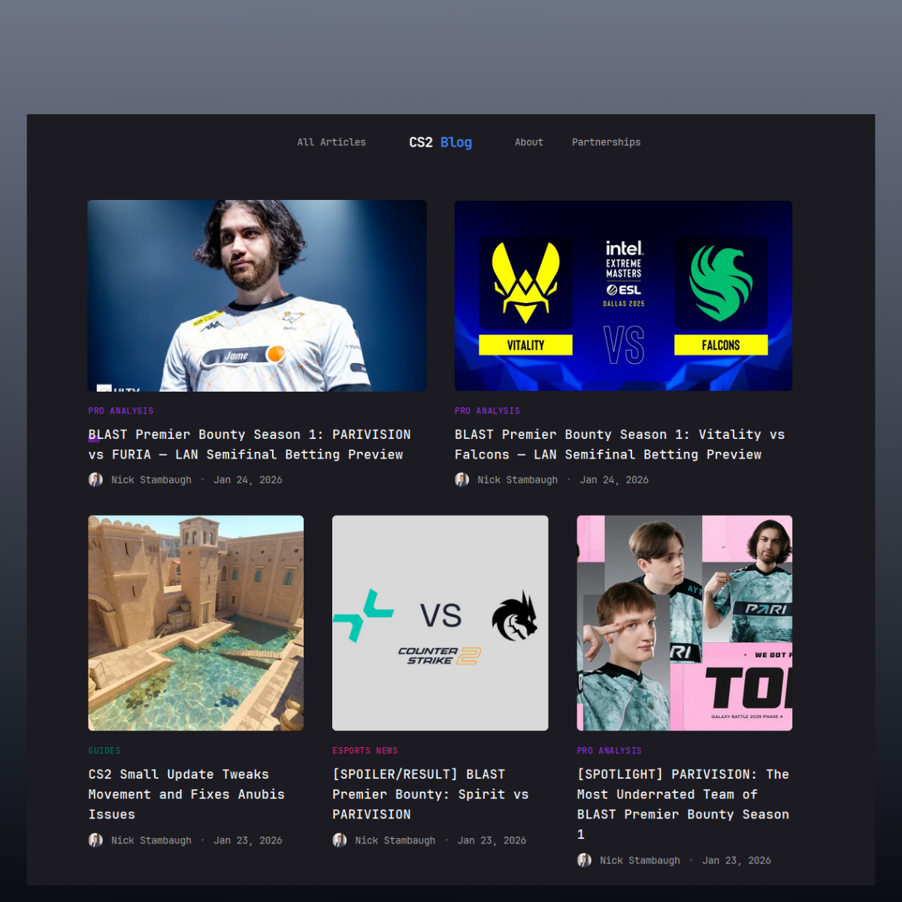

# counterstrike.blog source code

## Live Demo

### [https://counterstrike.blog](https://counterstrike.blog)

## Use the base template to deploy on Vercel

I used a [template](https://github.com/web3templates/stablo-astro) to create this website, you can deploy it yourself.

TailwindCSS is already configured in this repo, so you can start using it without any installation.

## Want to learn more?

Feel free to check out [Astro Docs](https://docs.astro.build)

